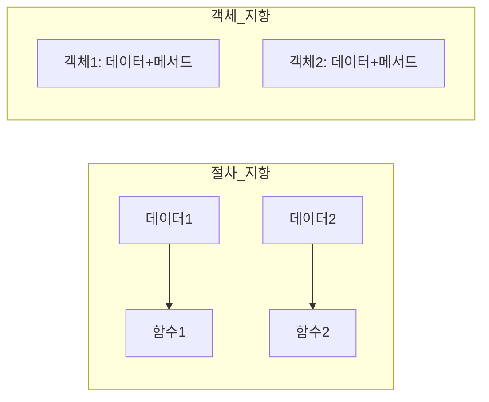
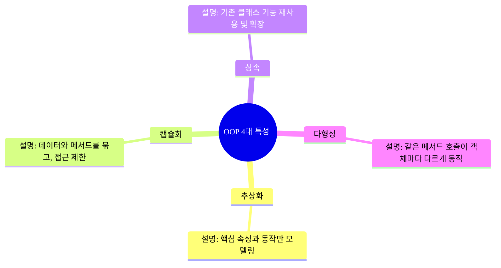

# OOP란?
OOP는 **객체 지향 프로그래밍(object-oriented programming)** 의 약자이다.
객체 지향 프로그램밍은 sw를 개발 할 때, **Object** 라는 개념을 중심으로 프로그램을 구성하는 방법론
객체는 데이터와 이 데이터를 처리하는 함수를 하나로 묶은 단위이다.
목표는 코드의 재사용성, 유지 보수성, 확장성을 높이는 것

# 절차 지향 VS 객체 지향


| 구분      | 절차 지향 | 객체 지향        |
| ------- | ----- | ------------ |
| 데이터와 동작 | 분리    | 객체에 함께 포함    |
| 코드 구조   | 순서 중심 | 현실 세계 모델링 중심 |
| 재사용성    | 낮음    | 높음           |
| 유지보수    | 어려움   | 쉬움           |
| 확장성     | 불편    | 편리           |
# OOP의 4대 특성


# 주요 용어
- 클래스(class) : 객체를 만들기 위한 설계도
- 객체(object) : class 에서 생성된 실제 인스턴스
- 속성(attribute) : 객체가 가진 데이터
- 메서드(method) : 객체가 수행하는 동작
- 생성자(Constructor) : 객체 생성 시 초기화 담당 메서드
- 오버라이딩(Overriding) : 상속받은 메서드를 재정의
- 합성(Composition) : 객체가 다른 객체를 속성으로 포함하는 관계("has-a")

# 예시로 이해하는 OOP
## 클래스와 객체
> 클래스는 객체를 만들기 위한 설계도이고, 객체는 그설계도를 기반으로 생성된 실체

```python
class Car :
	def __init__(self,brand,model):
		self.brand = brand
		self.model = model

	def drive(self) :
		print(f"{self.brand} {self.model} is driving")
myCar = Car("Tesla","Model S")
myCar.drive() # Teslas Model S is driving
```

## 상속(Inheritance)
> 기존 클래스를 기반으로 새로운 클래스를 만들고 기능을 추가

```python
class ElectricCar(Car):
    def charge(self):
        print(f"{self.brand} {self.model} is charging!")

my_electric_car = ElectricCar("Tesla", "Model X")
my_electric_car.charge() # Tesla Model X is charging!
```


## 캡슐화(Encapsulation)
> `__brand` 처럼 속성을 private으로 선언해 외부에서 직접 접근을 막고, 메서드를 통해 접근하도록 함

```python
class Car:
    def __init__(self, brand, model):
        self.__brand = brand  # private 속성
        self.model = model

    def get_brand(self):
        return self.__brand

my_car = Car("Tesla", "Model S")
print(my_car.model) # Model S
print(my_car.get_brand()) # Tesla
print(my_car.__brand) # error
```

## 다형성(Polymorphism)
> 같은 메서드(speak)를 호출하지만, 객체 타입에 따라 다른 동작을 수행

```python
class Animal:
    def speak(self):
        print("Animal speaks")

class Dog(Animal):
    def speak(self):
        print("Woof")

class Cat(Animal):
    def speak(self):
        print("Meow")

animals = [Dog(), Cat()]
for animal in animals:
    animal.speak()

Woof
Meow
```

# 절차 지향 -> OOP 예시

## 절차 지향
> 데이터와 함수를 따로 관리하며, 종이 늘어날 수록 함수와 분기문도 함께 늘어나는 방식

```python
dog_name = "바둑이"
cat_name = "나비"

def dog_speak(name):
    print(f"{name}: 멍멍!")

def cat_speak(name):
    print(f"{name}: 야옹!")

dog_speak(dog_name)
cat_speak(cat_name)
```

## 객체 지향
> 동물이라는 공통 클래스를 만들고, 각 동물별 동작을 상속/오버라이딩으로 정의하여 확장성과 유지보수성을 높임

```python
class Animal:
    def __init__(self, name):
        self.name = name
    def speak(self):
        print(f"{self.name}: ...")

class Dog(Animal):
    def speak(self):
        print(f"{self.name}: 멍멍!")

class Cat(Animal):
    def speak(self):
        print(f"{self.name}: 야옹!")

zoo = [Dog('바둑이'),Cat('나비')]

for i in zoo :
    i.speak()

바둑이: 멍멍!
나비: 야옹!
```

# 상속(Inheritance)과 합성(Composition)
## 상속과 합성 비교

| 구분  | 상속                        | 합성                                        |
| --- | ------------------------- | ----------------------------------------- |
| 관계  | “is-a” 관계                 | “has-a” 관계                                |
| 예시  | 개는 동물이다(Dog is an Animal) | 개는 짖는 행동을 가지고 있다(Dog has a Bark behavior) |
| 특징  | 부모-자식 계층 구조               | 객체 안에 다른 객체를 넣음                           |
| 장점  | 코드 재사용이 쉽다                | 유연하게 동작을 교체 가능                            |
| 단점  | 부모 변경 시 자식에 영향 큼(결합도↑)    | 구현이 조금 더 복잡                               |

## 왜 합성이 필요한가?
상속만 쓰다 보면, 아래와 같은 문제가 발생함
- 부모 클래스가 바뀌면 모든 자식 클래스가 영향을 받음(결합도 높음)
- 여러 동작을 조합해야 하면, **다중 상속 문제** 가 생김
- 런타임(실행 중)에 행동을 바꾸기가 어려움

## 전략 패턴(Strategy Pattern) 이란?
- 행동(전략)을 별도 객체로 분리해서, 필요해서 끼워 넣는 방식
- 즉, 상속 대신 객체를 주입해서 행동을 바꾸는 구조
- 실행 중에도 전략을 바꿀 수 있음 -> 유연한 구조

## 예시

### 상속
```python
class Animal:
    def speak(self):
        pass

class Dog(Animal):
    def speak(self):
        print("멍멍!")

class Cat(Animal):
    def speak(self):
        print("야옹!")
```
- `Dog`이 짖는 방법을 바꾸고 싶다면 `Dog` 클래스를 수정
- 새로운 짖는 방식이 필요하면, 또 다른 자식 클래스가 필요함

### 합성(전략 패턴)
```python
class BarkStrategy:
    def sound(self, name):
        return f"{name}: 멍멍!"

class QuietBarkStrategy:
    def sound(self, name):
        return f"{name}: 왈..."

class Animal:
    def __init__(self, name, sound_strategy):
        self.name = name
        self.sound_strategy = sound_strategy

    def speak(self):
        print(self.sound_strategy.sound(self.name))

dog = Animal("바둑이", BarkStrategy())
dog.speak()  # 바둑이: 멍멍!

# 실행 중에 짖는 방식 변경 가능
dog.sound_strategy = QuietBarkStrategy()
dog.speak()  # 바둑이: 왈...
```
- `Animal` 클래스는 소리내는 방법을 직접 갖고 있지 않고, BarkStartegy라는 객체에 맡김
- 실행 중에도, `sound_strategy`를 다른 전략으로 교체 가능

# SOLID 원칙
> 객체 지향 프로그래밍에서 유지보수성과 확정성을 높이기 위해서 지켜야하는 설계원칙


| 약자  | 이름                                    | 한글 뜻        | 핵심 포인트                                   |
| --- | ------------------------------------- | ----------- | ---------------------------------------- |
| S   | Single<br>Responsibility<br>Principle | 단일 책임 원칙    | 클래스는 하나의 책임만<br>가져야한다                    |
| O   | Open/Closed<br>Principle              | 개방-폐쇄 원칙    | 확장에는 열려 있고, 수정에는 닫혀 있어야한다.               |
| L   | Liskov<br>Substitution<br>Principle   | 리스코프 치환 원칙  | 부모 타입 대신 자식 타입을 넣어도 동작에 문제가 없어야한다.       |
| I   | Interface<br>Segregation<br>Principle | 인터페이스 분리 원칙 | 큰 인터페이스 대신, 필요한 기능만 담은 작은 인터페이스 여러개로 나눠라 |
| D   | Dependency<br>Inversion<br>Principle  | 의존 역전 원칙    | 구체 클래스보다 추상(인터페이스/추상 클래스)에 의존해라          |
## 세부 내용

### S - 단일 책임 원칙
> 클래스는 "하나의 책임"만 가져야 하고, 변경 이유도 하나여야 한다.

```python
# 단일 책임 위반: 데이터 저장과 출력 책임이 한 클래스에 있음
class Report:
    def save_to_file(self, data):
        pass
    def print_report(self):
        pass

# 단일 책임 준수
class ReportSaver:
    def save_to_file(self, data):
        pass

class ReportPrinter:
    def print_report(self, report):
        pass
```
- 이렇게 분리되면, 저장 방식이 바뀌어도 출력 기능에는 영향이 없음

### O - 개방-폐쇄 원칙
> 기능 확장은 가능하지만, 기존 코드를 수정하지 않게 설계

```python
#위반: 새로운 동물 추가할 때마다 if문 수정
def speak(animal_type):
    if animal_type == "dog":
        print("멍멍!")
    elif animal_type == "cat":
        print("야옹!")

#준수: 상속으로 확장 가능
class Animal:
    def speak(self):
        pass

class Dog(Animal):
    def speak(self):
        print("멍멍!")

class Cat(Animal):
    def speak(self):
        print("야옹!")
```
- 새로운 동물 클래스만 추가하면 기존 코드를 수정할 필요 없음

### L -리스코프 치환 원칙
> 부모 타입을 사용하는 곳에 자식 타입을 넣어도, 프로그램이 정상 동작해야 한다
> 즉, 부모 클래스(인터페이스)를 사용하는 쪽은 그게 정확히 어떤 자식인지 몰라도, 동일하게 동작해야한다.

```python

```