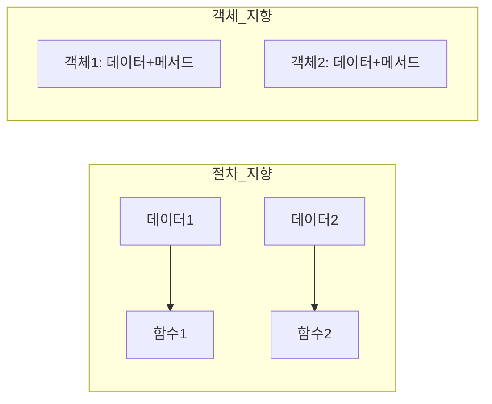
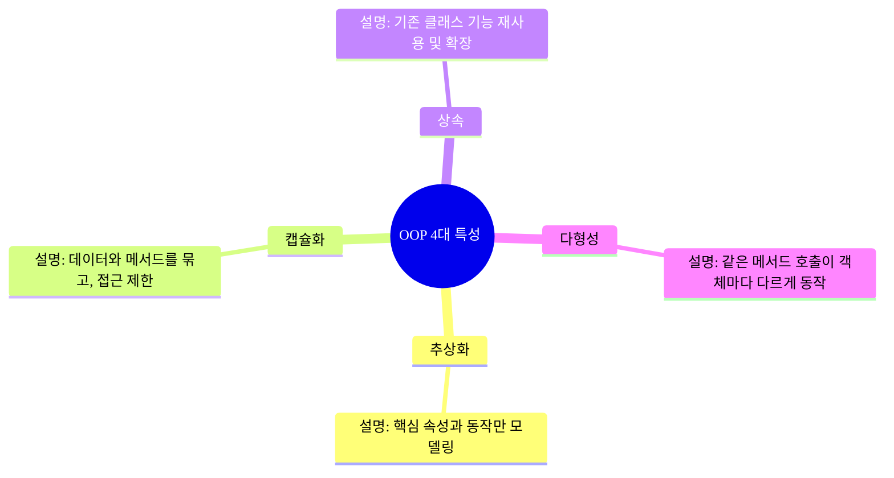

# OOP란?
OOP는 **객체 지향 프로그래밍(object-oriented programming)** 의 약자이다.
객체 지향 프로그램밍은 sw를 개발 할 때, **Object** 라는 개념을 중심으로 프로그램을 구성하는 방법론
객체는 데이터와 이 데이터를 처리하는 함수를 하나로 묶은 단위이다.
목표는 코드의 재사용성, 유지 보수성, 확장성을 높이는 것

# 절차 지향 VS 객체 지향


| 구분      | 절차 지향 | 객체 지향        |
| ------- | ----- | ------------ |
| 데이터와 동작 | 분리    | 객체에 함께 포함    |
| 코드 구조   | 순서 중심 | 현실 세계 모델링 중심 |
| 재사용성    | 낮음    | 높음           |
| 유지보수    | 어려움   | 쉬움           |
| 확장성     | 불편    | 편리           |
# OOP의 4대 특성


# 주요 용어
- 클래스(class) : 객체를 만들기 위한 설계도
- 객체(object) : class 에서 생성된 실제 인스턴스
- 속성(attribute) : 객체가 가진 데이터
- 메서드(method) : 객체가 수행하는 동작
- 생성자(Constructor) : 객체 생성 시 초기화 담당 메서드
- 오버라이딩(Overriding) : 상속받은 메서드를 재정의
- 합성(Composition) : 객체가 다른 객체를 속성으로 포함하는 관계("has-a")

# 예시로 이해하는 OOP
## 클래스와 객체
```python
class Car :
	def __init__(self,brand,model):
		self.brand = brand
		self.model = model

	def drive(self) :
		print(f"{self.brand} {self.model} is driving")
myCar = Car("Tesla","Model S")
myCar.drive() # Teslas Model S is driving
```

## 상속(Inheritance)
```python
class ElectricCar(Car):
    def charge(self):
        print(f"{self.brand} {self.model} is charging!")

my_electric_car = ElectricCar("Tesla", "Model X")
my_electric_car.charge() # Tesla Model X is charging!
```


## 캡슐화(Encapsulation)
```python
class Car:
    def __init__(self, brand, model):
        self.__brand = brand  # private 속성
        self.model = model

    def get_brand(self):
        return self.__brand

my_car = Car("Tesla", "Model S")
print(my_car.model) # Model S
print(my_car.get_brand()) # Tesla
print(my_car.__brand) # error
```

## 다형성(Polymorphism)
```python
class Animal:
    def speak(self):
        print("Animal speaks")

class Dog(Animal):
    def speak(self):
        print("Woof")

class Cat(Animal):
    def speak(self):
        print("Meow")

animals = [Dog(), Cat()]
for animal in animals:
    animal.speak()

Woof
Meow
```

# 절차 지향 -> OOP 예시

## 절차 지향
```python
```

## 객체 지향
```python
```